# Motor Originação — Arquitetura AS-IS / TARGET e Release Scorecard

**Data:** 21/07/2026  
**Main:** `956382fa7b4f3cd679dcb29f8b7923652a9614f8`

## Resumo

A stack está adequada. O problema é de fechamento de loops operacionais, não de arquitetura.

## AS-IS

```mermaid
flowchart LR
    Companies[8 companies] --> Monitoring
    Monitoring --> Outputs[13.152 outputs]
    Outputs --> Signals[16.048 signals]
    Signals --> Enrichments[3.793 enrichments]
    Enrichments --> Qualification[888 snapshots]
    Qualification --> Scores[4.392 scores]
    Scores --> Ranking[72 ranking snapshots]
    Ranking -. incompleto .-> Pipeline
```

## Loops abertos

1. Search Profile sem execução persistida.
2. Discovery sem candidatos.
3. Promoção depende da reconciliação #161.
4. Triggers zerados.
5. Thesis limitada a três registros.
6. Market Map zerado.
7. Ranking sem garantia de owner e próxima ação.
8. Paper Clip sem executor persistido.

## TARGET

Não criar nova arquitetura. Completar os loops nos módulos existentes.

## Release Scorecard

| Dimensão | Estado | Nota / 5 | Evidência |
|---|---|---:|---|
| Stack e monorepo | Real | 4 | frontend/backend/build |
| Supabase | Real parcial | 4 | dados persistidos |
| Auth | Parcial | 3 | endpoint CVM autenticado; autorização total pendente |
| CVM ingestion | Real parcial | 4 | pipeline, health e dashboard |
| Source health | Real parcial | 4 | runs e painel; maioria partial |
| Discovery | Não operacional | 1 | zero runs/candidatos |
| Company Master | Parcial | 2 | oito empresas; promoção pendente |
| Qualification | Real parcial | 3 | 888 snapshots |
| Patterns | Parcial | 2 | validar cobertura e freshness |
| Ranking | Real parcial | 3 | 72 snapshots |
| Triggers | Não operacional | 0 | zero eventos |
| Thesis | Parcial | 1 | três outputs |
| Market Map | Não operacional | 0 | zero cards |
| Pipeline | Parcial | 2 | owners/actions precisam auditoria |
| Paper Clip | Mock | 0 | in-memory; zero agent runs |
| Deployment governance | Parcial | 3 | previews verdes; SHA canônico pendente |
| Observabilidade | Parcial | 3 | CVM health; quotas incompletas |
| Documentação | Forte | 4 | Bible + control plane |

## Nota geral

**2,5 / 5 — plataforma de dados real, sistema de originação ainda incompleto.**

## Gate para 3,5 / 5

- #161 e #162 reconciliadas;
- 50 candidatos;
- 20 promoções;
- triggers;
- thesis top 20;
- owners e próximas ações.

## Gate para 4,5 / 5

- Paper Clip real;
- comparables;
- Copilot com evidence;
- observabilidade e quotas completas;
- conversão comercial mensurada.
