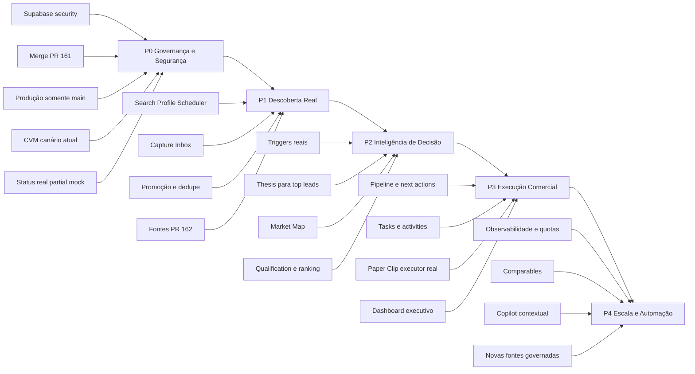

# Origination Intelligence Platform — Status Real e Roadmap Executivo

**Data-base:** 17/07/2026  
**Repositório canônico:** `Marcelo-teets/Motor-originac-srm`  
**Branch-base auditada:** `main` em `1e5c8a7b22db935953bd9f7cc8f95c6948cc3d60`  
**Supabase:** `Motor_orig` — `hdghpmssudrqhsbvrdyt`  
**Vercel:** `motor-originac-srm` — `prj_hsB473e7bNF0xOd6CEUwo7WFgNYs`

## 1. Regra de produto

Toda entrega deve melhorar diretamente a capacidade de descobrir empresas certas, detectar mudanças, explicar a necessidade financeira, indicar a estrutura de crédito, justificar o timing, recomendar a próxima ação e transformar inteligência em pipeline real.

Não reabrir arquitetura. Não criar stack paralela. Não expandir fontes antes de fechar confiabilidade, segurança e uso operacional das fontes já existentes.

## 2. Diagnóstico executivo

O projeto já deixou de ser apenas protótipo. Há captura e processamento reais, mas o sistema ainda não é um MVP operacional completo.

### O que está realmente funcionando

- Monorepo oficial consolidado com frontend, backend, migrations, workflows e documentação.
- Supabase ativo e saudável.
- Monitoring real executado em 17/07/2026.
- Persistência relevante:
  - 12.576 `monitoring_outputs`;
  - 15.190 `company_signals`;
  - 3.617 `enrichments`;
  - 840 `qualification_snapshots`;
  - 840 `lead_score_snapshots`;
  - 4.200 `score_snapshots`;
  - 48 snapshots em `ranking_v2`.
- 48 fontes cadastradas.
- 936 execuções de conectores: 93 `completed` e 843 `partial`.
- CI verde nas PRs #161 e #162.
- URL canônica responde HTTP 200 e `/api/health` informa modo `real`.
- Pipeline base persistido para 8 empresas.

### O que ainda não está operacional

- Apenas 8 empresas no universo canônico.
- `search_profile_runs = 0`.
- `discovered_company_candidates = 0`.
- `company_discovery_links = 0`.
- `trigger_events = 0`.
- `market_map_cards = 0`.
- Apenas 3 `thesis_outputs`, sem atualização desde maio.
- Tarefas e atividades comerciais estão antigas.
- Paper Clip/ABA/ADM aparecem como `real`, mas o serviço atual apenas grava comandos em memória e retorna sucesso imediato; não há executor real, persistência, task/activity output nem trilha de auditoria.
- `ai_agent_runs = 0`, `code_improvement_proposals = 0` e `engine_requests = 0`.
- Observabilidade de quota/conectores não está populada.
- BCB SGS, bronze histórico e eventos de mercado ainda não possuem registros persistidos.

## 3. Bloqueadores P0

### P0.1 — Segurança Supabase

O Security Advisor apontou:

- `capital_market_ingestion_health` como `SECURITY DEFINER`;
- funções `sync_capital_market_discovered_candidates` e `trigger_sync_capital_market_discovered_candidates` executáveis por `anon`;
- as mesmas funções executáveis por `authenticated`;
- `ranking_v2` com RLS habilitado e sem policy;
- leaked password protection desabilitado.

**Ação:** migration idempotente para revogar permissões indevidas, tornar a view segura e definir policies mínimas. Reexecutar advisors antes do merge.

### P0.2 — Drift entre banco e GitHub

O Supabase vivo já contém migrations/ajustes relacionados à promoção de candidatos CVM que ainda estão na PR #161, não na `main`.

**Ação:** revisar e mergear #161 antes de novas mudanças de schema. Depois gerar novo diff canônico e confirmar que o banco pode ser reconstruído apenas pelo repositório.

### P0.3 — Alias/deploy da Vercel sem governança

O domínio canônico está entregando o mesmo bundle da preview da PR #162, embora a Vercel registre essa implantação como preview (`target = null`).

**Ação:** impedir que o domínio canônico aponte para branch não mergeada. Produção deve ser promovida apenas a partir de `main`, com SHA verificável no health endpoint.

### P0.4 — CVM sem execução recente saudável

Há duas execuções completas em 15/07, seguidas por execuções falhas/supersedidas. Não há nova execução CVM bem-sucedida após isso.

**Ação:** rodar um canário atual, garantir idempotência, persistência, geração de candidatos e ausência de timeout serverless.

### P0.5 — Estados falsamente `real`

Paper Clip, ABA, ADM e alguns catálogos de fontes são anunciados como reais sem execução comprovável.

**Regra:**
- `real`: executa, persiste, audita e passa smoke;
- `partial`: possui integração incompleta/fallback;
- `mock`: não executa o processo real.

## 4. Situação das PRs abertas

| PR | Situação | Decisão |
|---|---|---|
| #161 — promoção de candidatos CVM | Aberta, CI verde, compatível com schema vivo | **Mergear primeiro**, após revisão final |
| #162 — expansão de fontes | Draft, CI e preview verdes | Rebasear após #161, revisar migrations 048–050, corrigir alias e só então mergear |
| #154 — source intelligence/UI | Draft antiga e ampla | Extrair apenas itens não cobertos; fechar como supersedida ou recriar PR mínima |
| #133 — release gates/secrets | Issue aberta | Atualizar checklist conforme estado real; fechar apenas com evidência |
| #99 — observabilidade/quota | Issue aberta | Executar após P0, antes de nova expansão de fornecedores |
| #128, #86, #68, #69 | Issues antigas | Auditar e fechar/reescrever conforme schema e smokes atuais |

## 5. Roadmap atualizado

### Fase P0 — Estabilização institucional

**Objetivo:** garantir que o que aparece como real seja seguro, reproduzível e implantado pela `main`.

Entregas:
1. Merge seguro da #161.
2. Migration de segurança Supabase.
3. SHA de deploy exposto em `/api/health`.
4. Alias canônico bloqueado para previews.
5. Canário CVM atual e idempotente.
6. Revisão dos statuses de agentes/fontes.
7. Secrets e monitores da issue #133 validados sem expor valores.

Critério de saída:
- Security Advisor sem ERROR e sem funções administrativas expostas a `anon`;
- domínio canônico ligado a deployment de `main`;
- repo e banco sem drift conhecido;
- CVM executado com sucesso;
- nenhuma capability falsa como `real`.

### Fase P1 — Descoberta real e Capture Inbox

**Objetivo:** sair de 8 empresas estáticas para um fluxo governado de candidatos reais.

Entregas:
1. Scheduler de `search_profiles`.
2. Persistência de `search_profile_runs`.
3. Candidatos em `discovered_company_candidates`.
4. Dedupe por CNPJ/domínio/nome.
5. Promoção revisável para `companies`.
6. Aplicação das migrations 048–050 da #162 após rebase.
7. Saúde por fonte calculada com runs reais, não apenas catálogo.

Critério de saída:
- pelo menos 1 perfil ativo executando diariamente;
- pelo menos 50 candidatos novos/revisáveis;
- pelo menos 20 empresas promovidas com evidência;
- lineage candidato → empresa → fonte.

### Fase P2 — Inteligência de decisão

**Objetivo:** transformar dados em tese comercial e estrutura de crédito.

Entregas:
1. `trigger_events` a partir de sinais materiais.
2. `thesis_outputs` atualizados para empresas prioritárias.
3. `market_map_cards` com FIDC/DCM/estrutura alternativa.
4. Recalcular qualification/pattern/lead/ranking somente com dados frescos.
5. Company Detail com evidência, rationale, estrutura e próxima ação.
6. Regras para não contar duplicatas de sinais como convicção adicional.

Critério de saída: top 20 leads com score, rationale, evidências, padrão, estrutura sugerida, por que agora e próxima ação.

### Fase P3 — Sistema operacional comercial

**Objetivo:** ligar ranking à execução de originação.

Entregas:
1. Pipeline com owner, estágio, próxima ação e vencimento.
2. Tasks/activities geradas e atualizadas.
3. Paper Clip real com persistência, estados, retries, idempotência, audit log e autorização.
4. Dashboard orientado a decisão.
5. War room semanal e alertas de SLA.

Critério de saída:
- 100% dos top leads com owner e next action;
- nenhum lead prioritário sem tarefa;
- Paper Clip gera saída persistida e auditável.

### Fase P4 — Escala

**Objetivo:** aumentar cobertura sem perder governança.

Entregas:
1. Observabilidade e quotas (#99).
2. BCB SGS persistido.
3. Comparables engine.
4. Copilot contextual com citações internas.
5. Views/materialized views de leitura.
6. Novas fontes conforme valor marginal comprovado.
7. Backfills históricos governados.

## 6. Definition of Done do MVP real

O MVP é considerado funcional somente quando:

- Auth real e autorizado.
- Produção deriva da `main`.
- Security Advisor sem bloqueadores.
- 1+ perfil de busca roda automaticamente.
- 50+ candidatos governados.
- 20+ leads reais promovidos.
- Top 20 com qualification, pattern, lead score, ranking, thesis e market map.
- Monitoring e lineage atualizados diariamente.
- Triggers materiais geram atualização de ranking.
- Pipeline possui owner e próxima ação.
- Paper Clip cria tarefas/atividades persistidas.
- Dashboard não depende de fallback mock para decisões principais.
- CI, migration check, smoke Supabase e smoke Vercel verdes.
