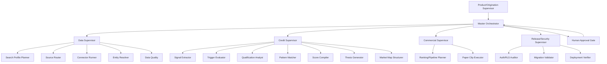
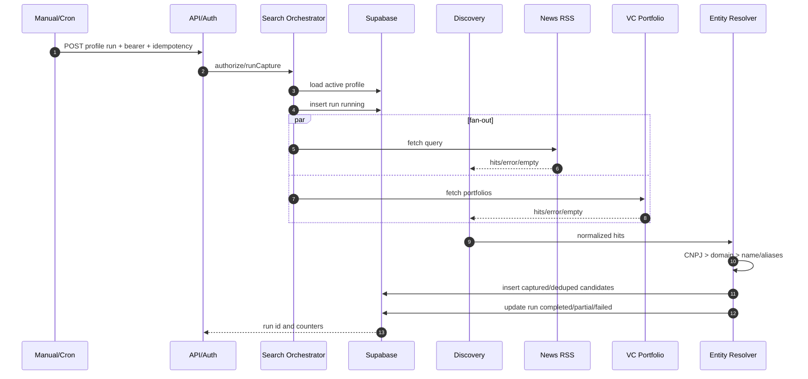
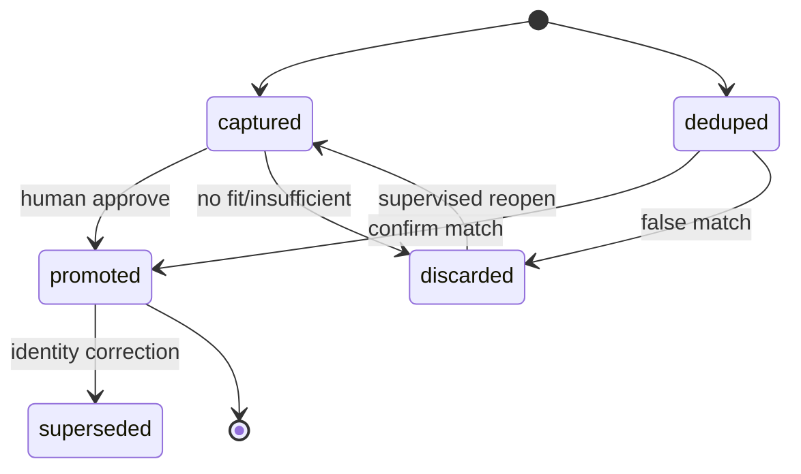
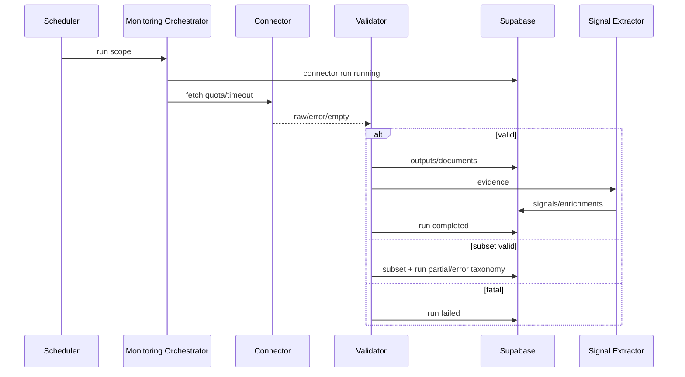
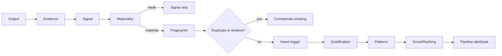
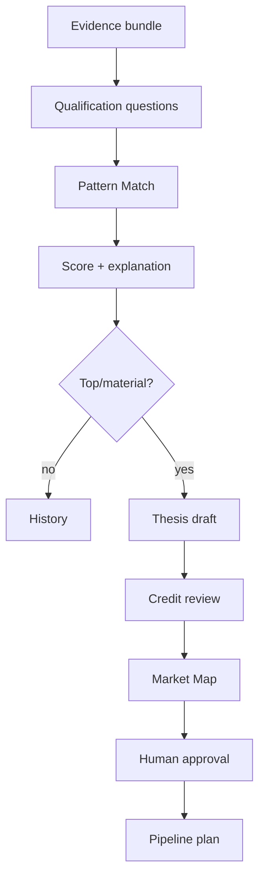
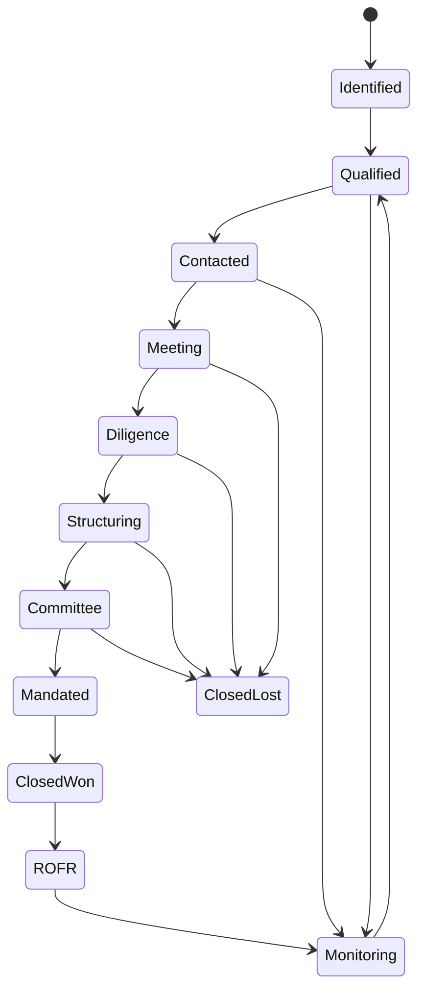
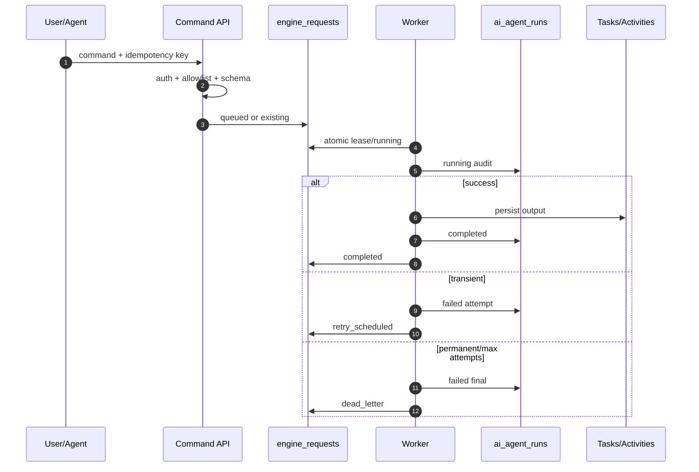
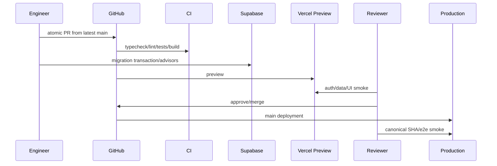
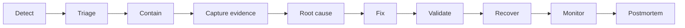

# Motor Originação — Atlas Resumido de Execução

## 1. Orquestração

Especialistas não se autoaprovam. Promoção fuzzy, tese, estrutura, contato externo e ação destrutiva exigem gate humano.

## 2. Search Profile run

Falhas: 401/403 sem writes; profile inativo 409; source degradada gera `partial`; todas falham gera `failed`; lease expirado gera recovery; retry não duplica run/candidato.

## 3. Candidate lifecycle

Promotion target: company upsert + discovery link + candidate update na mesma transação lógica; monitoring/recompute como hooks pós-commit auditáveis.

## 4. Monitoring e signals

## 5. Signal → Trigger → Recompute

## 6. Qualification e thesis

## 7. Pipeline

Toda transição registra actor, timestamp, reason, evidence, previous/new stage, next action e due date.

## 8. Paper Clip durável

## 9. Release

## 10. Incident

O Atlas integral contém os fluxos expandidos, catálogo de agentes, state machines e 100 tarefas atômicas.