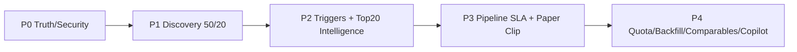

# Origination Intelligence Platform — Control Plane V4.1

**Data-base:** 21/07/2026  
**Main auditada:** `a38d45f6734fad489af75f32067251147d4bbe0b`

Esta pasta substitui operacionalmente os planos de 17/07/2026. Documentos antigos permanecem como histórico, mas não devem ser usados para executar as PRs #154, #161 ou #162, que foram superseded por #168, #169 e #170.

## Fonte de verdade

1. `origination_project_brain_master.txt`;
2. código e migrations na `main`;
3. Supabase/Vercel vivos;
4. documentos V4.1 desta pasta;
5. documentação histórica.

## Estado auditado

- 8 empresas;
- 1 Search Profile ativo e zero runs;
- zero candidatos e zero links de discovery;
- 13.795 monitoring outputs;
- 16.268 signals;
- 904 qualification e 904 lead score snapshots;
- 88 ranking snapshots;
- zero triggers;
- 3 thesis antigas;
- zero Market Map;
- 6 tarefas vencidas;
- zero `engine_requests` e zero `ai_agent_runs`;
- 61 fontes;
- 1.032 connector runs, sendo 101 completed e 931 partial.

## Regra de realidade

Uma capability só é `real` quando executa, persiste, audita e passa smoke em produção derivada da `main`.

## Critical path

## Documentos

- `PROJECT_CONTROL_V4_1.md`: status, arquitetura, gates e ordem de PRs;
- `EXECUTION_ATLAS_SUMMARY_V1.md`: fluxos e state machines centrais;
- `ROADMAP_TRACKER_V4_1.yaml`: tracker legível por agentes;
- `PROMPT_CODEX_V4_1.md`: implementação;
- `PROMPT_WARP_V4_1.md`: operação e validação.

O pacote integral, com Bible, Atlas completo, 100 tarefas atômicas, contratos, incidentes e runbooks, foi gerado separadamente para incorporação progressiva em PRs atômicas.